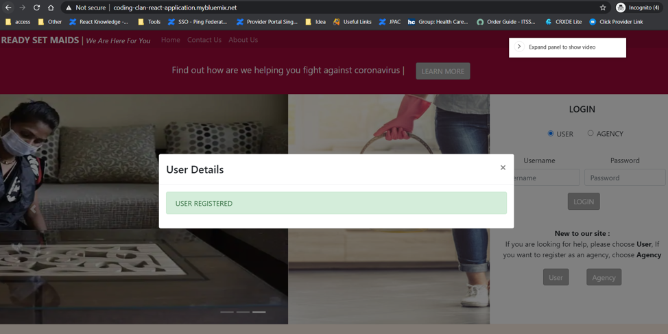
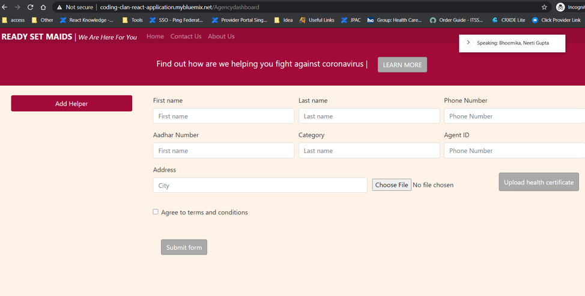
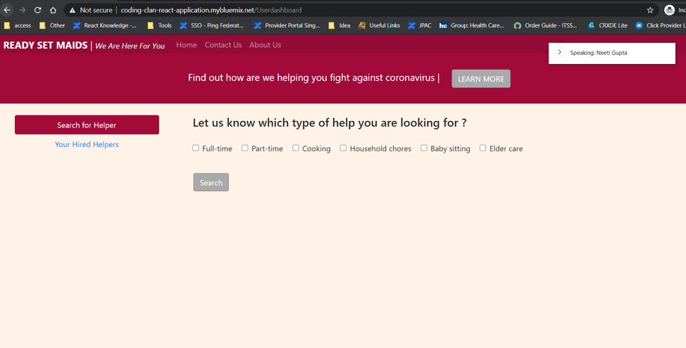
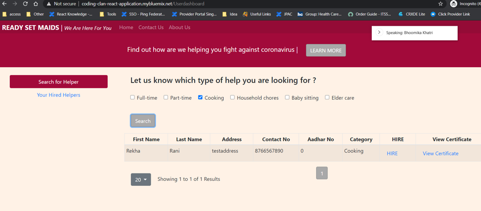
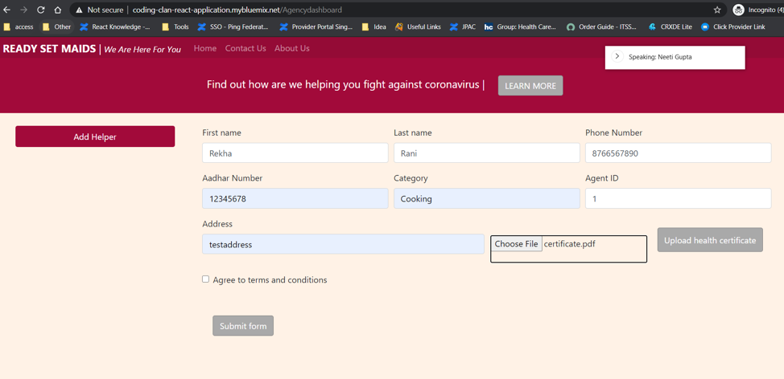
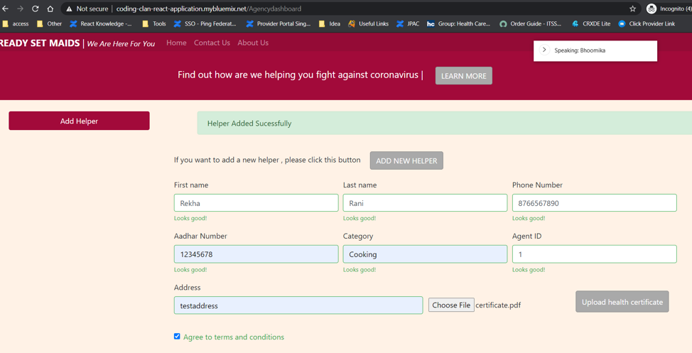

This project was bootstrapped with [Create React App](https://github.com/facebook/create-react-app).

React is a one of the most popular front end view frameworks
- Components
- JSX
- State
- Props

In combination with other libraries, React helps in doing a wide variety of front end features
- Forms Handling
- Routing System
- HTTP Requests

#### Required Tools

- Node v8+ for npm
- Java 8+
- IntelliJ 

## Available Scripts

In the project directory, we can run:

### `npm start`

Runs the app in the development mode. 
Open [http://localhost:3000](http://localhost:3000) to view it in the browser.

The page will reload if we make edits. 
we will also see any lint errors in the console.

### `npm test`

Launches the test runner in the interactive watch mode. 
See the section about [running tests](https://facebook.github.io/create-react-app/docs/running-tests) for more information.

### `npm run build`

Builds the app for production to the `build` folder. 
It correctly bundles React in production mode and optimizes the build for the best performance.

The build is minified and the filenames include the hashes. 
App is ready to be deployed!

See the section about [deployment](https://facebook.github.io/create-react-app/docs/deployment) for more information.

## Additional Information

React Official Website [React documentation](https://reactjs.org/).

## IBM cloud Deployment
We have deployed react application in IBM devops pipeline and used IBM Cloud Foundry for hosting our applications

## Verifying your Deployment 

1. Wait for Build and Deploy to compete
2. Wait an additional 5 minutes for your application to initialize
3. Lookup the Application URL in the console output of your build. 
4. Open the URL in a browser. You should see our Hackathon Website
   
   
    
   
   
    
